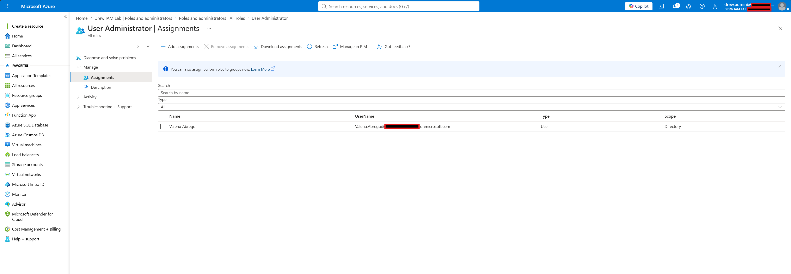
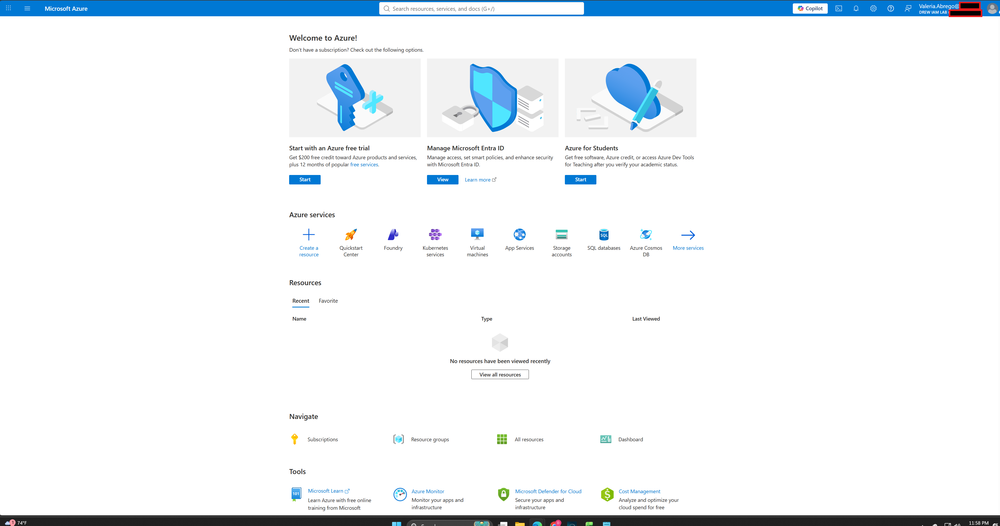
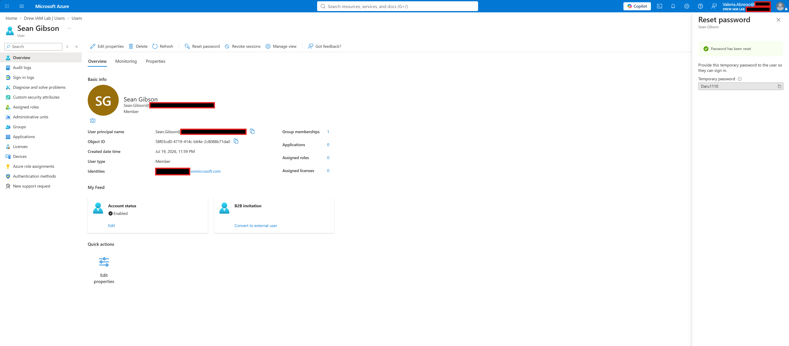
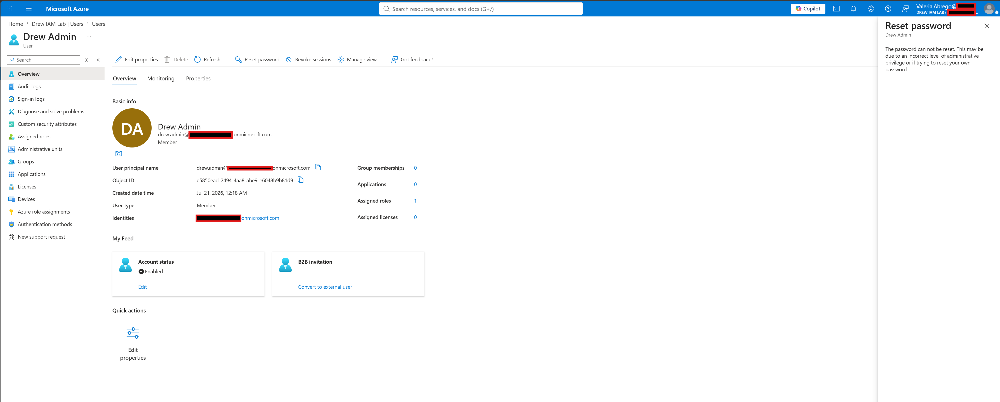

# Microsoft Entra ID RBAC Validation Lab

## Overview

This lab demonstrates the implementation and validation of Role-Based Access Control (RBAC) in Microsoft Entra ID using delegated administrative roles.

The objective was to configure a Help Desk administrator with the built-in **User Administrator** role, validate permitted administrative actions, and verify that Microsoft Entra correctly enforces privilege boundaries for higher-privileged accounts.

---

## Lab Objectives

- Create a delegated Help Desk administrator
- Assign the built-in **User Administrator** role
- Validate delegated administrative access
- Perform authorized administrative actions
- Test security boundaries against privileged accounts
- Document results for future reference

---

## Lab Environment

| Component | Details |
| --- | --- |
| Platform | Microsoft Entra ID |
| Tenant | Drew IAM Lab |
| License | Microsoft Entra ID Free |
| Administrative Role | User Administrator |
| Test Account | Valeria Abrego (Help Desk) |
| Privileged Account | Drew Admin (Global Administrator) |

---

## Lab Scenario

A Help Desk administrator requires the ability to assist users by performing common identity management tasks without receiving full administrative privileges.

Microsoft Entra's built-in **User Administrator** role was assigned to a Help Desk account to validate least-privilege administration.

---

# Validation Steps

## 1. Assigned User Administrator Role

The Help Desk account (Valeria Abrego) was assigned the built-in **User Administrator** role.

**Result**

- Role assignment completed successfully.

---

## 2. Verified Delegated Administrator Sign-In

Signed into Microsoft Entra using the delegated Help Desk account.

**Result**

- Successfully authenticated.
- MFA completed.
- Administrative portal accessible.

---

## 3. Validated Authorized Administrative Action

Using the delegated administrator account, successfully reset the password of a standard user.

**Result**

- Password reset completed successfully.
- Temporary password generated.
- Confirms delegated permissions are functioning correctly.

---

## 4. Validated RBAC Security Boundary

Attempted to reset the password of a Global Administrator account using the delegated Help Desk account.

**Result**

Microsoft Entra denied the operation because the delegated administrator lacked sufficient privileges.

This validates Microsoft's implementation of least privilege and prevents privilege escalation.

---

# Lessons Learned

This lab demonstrated several key Microsoft Entra identity management concepts:

- Administrative roles should follow the Principle of Least Privilege.
- Delegated administrators can successfully perform authorized administrative tasks.
- Microsoft Entra protects privileged administrative accounts from lower-privileged administrators.
- Validation testing is as important as configuration when implementing RBAC.

---

# Skills Demonstrated

- Microsoft Entra ID Administration
- Role-Based Access Control (RBAC)
- Delegated Administration
- Identity and Access Management (IAM)
- Password Management
- Least Privilege
- Security Validation
- Technical Documentation

---

# Conclusion

This lab successfully demonstrated the implementation and validation of delegated administration within Microsoft Entra ID.

The User Administrator role allowed a Help Desk administrator to manage standard users while preventing administrative actions against privileged Global Administrator accounts.

The results confirm Microsoft's enforcement of RBAC security boundaries and reinforce the importance of least-privilege administration in enterprise identity environments.
