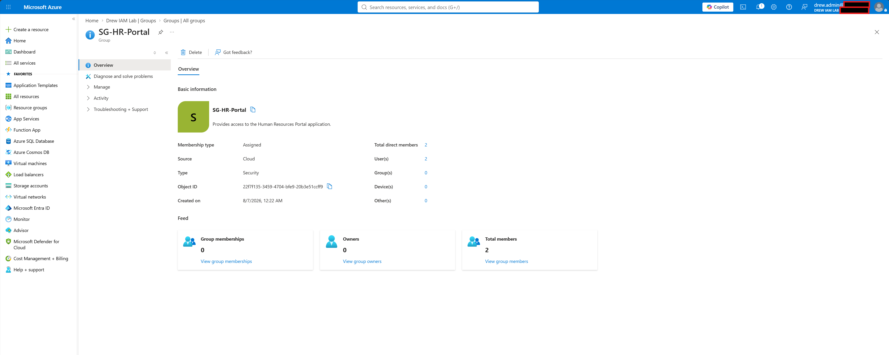
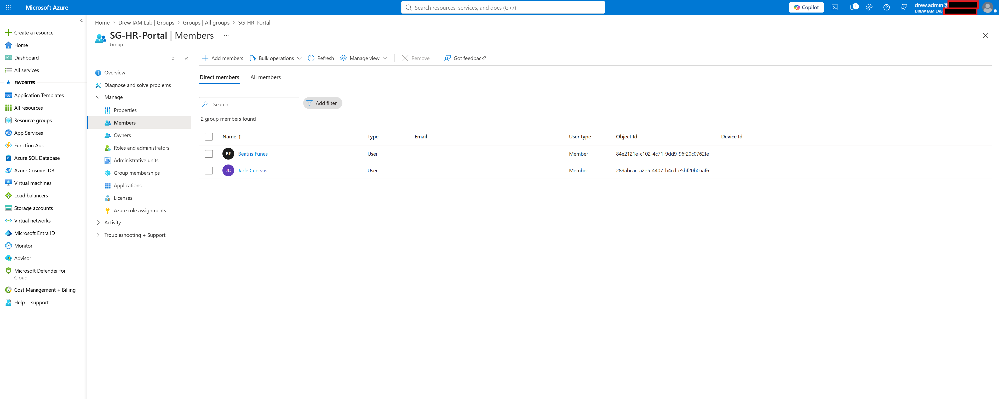
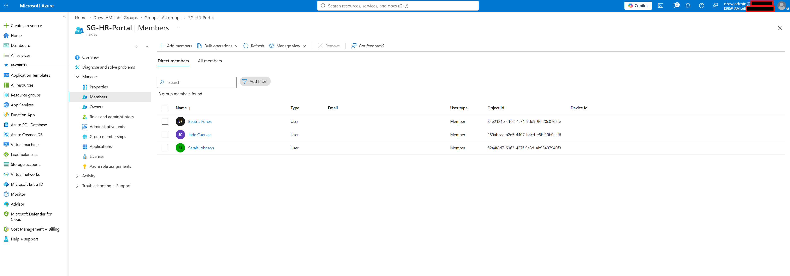
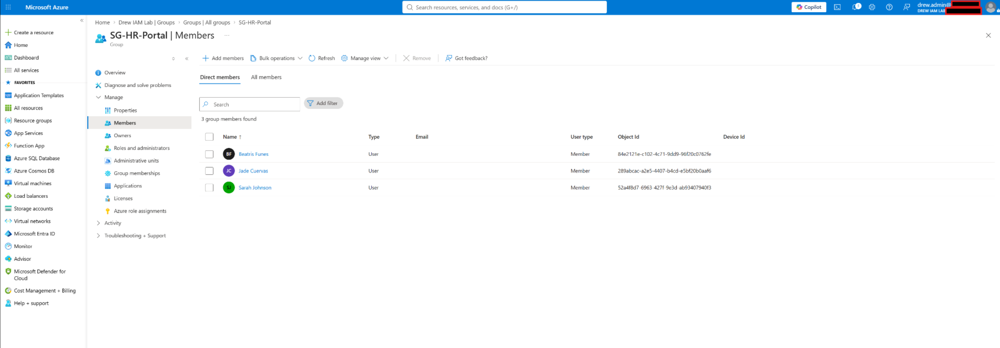
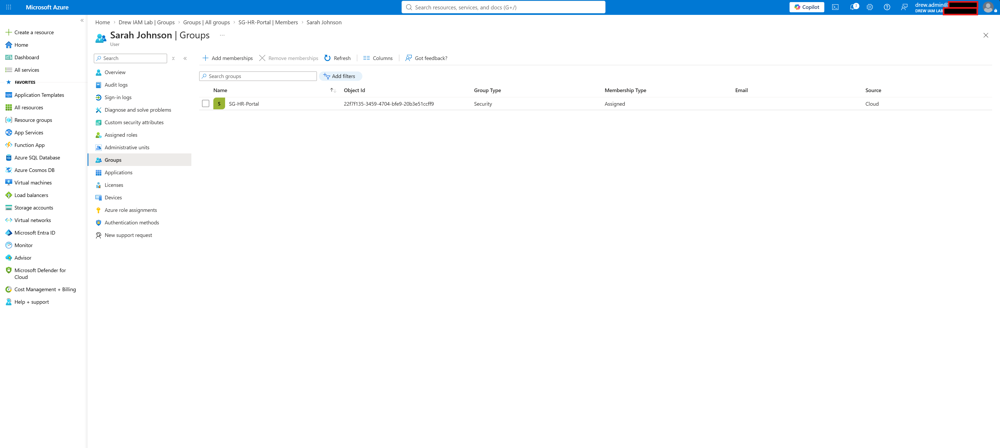
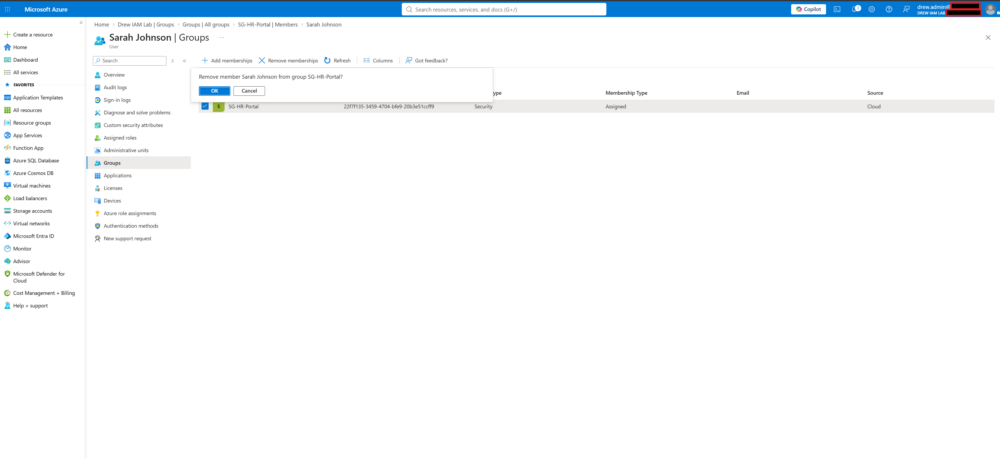
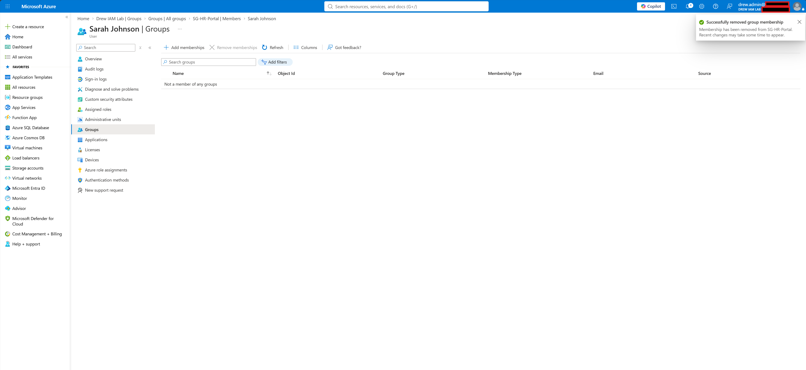

# Microsoft Entra ID Group-Based Access Control Lab

**Lab Status:** ✅ Completed

**Focus Area:** Security Groups and Group-Based Access Management

**Certification Alignment:** Microsoft SC-300 – Implement and Manage User Identities

---

## Overview

This lab demonstrates how Microsoft Entra ID security groups can be used to manage access through group membership instead of assigning permissions directly to individual users.

The objective was to create an application-style security group, assign users to the group, verify membership from both the group and user perspectives, and validate the full add/remove lifecycle.

---

## Lab Objectives

- Create a security group for application access
- Add existing HR users to the group
- Onboard a new HR employee
- Assign the new employee to the security group
- Verify membership from the group perspective
- Verify membership from the user perspective
- Remove the user from the group
- Confirm successful removal
- Reinforce least-privilege and group-based access principles

---

## Lab Environment

| Component | Details |
| --- | --- |
| Platform | Microsoft Entra ID |
| Tenant | Drew IAM Lab |
| Group Type | Security |
| Membership Type | Assigned |
| Security Group | SG-HR-Portal |
| Department | Human Resources |
| Test User | Sarah Johnson |

---

## Lab Scenario

The Human Resources department requires access to an internal HR Portal.

Instead of granting application access directly to individual users, access is represented through membership in the **SG-HR-Portal** security group.

A new HR employee was created and added to the security group to simulate a typical onboarding scenario.

---

# Validation Steps

## 1. Created HR Portal Security Group

Created the **SG-HR-Portal** security group using assigned membership.

The group was designed to represent access to the Human Resources Portal application.

**Result**

- Security group created successfully
- Membership type configured as Assigned
- Existing HR users added as members

---

## 2. Verified Existing Group Membership

Reviewed the members of **SG-HR-Portal** to confirm that the expected HR users were assigned.

**Result**

- Group membership displayed correctly
- Existing HR users were successfully associated with the security group

---

## 3. Added New HR Employee to Security Group

Created a new HR employee account and added the user to **SG-HR-Portal**.

**Result**

- New user successfully added to the group
- Group membership count updated

---

## 4. Verified User Addition from the Group Perspective

Reviewed the members of **SG-HR-Portal** after the new employee was added.

**Result**

- New employee appeared in the group's member list
- Membership change was successfully applied

---

## 5. Verified Membership from the User Perspective

Opened the new employee's account and reviewed group memberships.

**Result**

- SG-HR-Portal appeared in the user's group memberships
- Membership type displayed as Assigned
- Group source displayed as Cloud

---

## 6. Removed the User from the Security Group

Initiated removal of the new employee from **SG-HR-Portal**.

Microsoft Entra prompted for confirmation before completing the change.

---

## 7. Verified Membership Removal

After confirming the removal, the user's group memberships were reviewed again.

**Result**

- SG-HR-Portal no longer appeared in the user's memberships
- Microsoft Entra displayed a successful group membership removal notification
- The user was no longer a member of any groups

---

# IAM Concepts Demonstrated

This lab reinforced several core Identity and Access Management concepts:

- Group-based access control
- Least privilege
- Assigned group membership
- User onboarding
- Access provisioning
- Access removal
- Membership validation
- Joiner lifecycle processes
- Administrative verification

---

# Lessons Learned

Security groups provide a scalable way to manage access by assigning users to groups instead of managing permissions individually.

This approach simplifies onboarding and offboarding because access can be granted or removed through a single group membership change.

The lab also demonstrated the importance of validating access changes from both perspectives:

- The group should show the expected user.
- The user should show the expected group.

Testing both the addition and removal of group membership helps confirm that identity lifecycle changes were successfully applied.

---

# Skills Demonstrated

- Microsoft Entra ID Administration
- Security Group Management
- Group Membership Administration
- Identity Lifecycle Management
- Access Provisioning
- Access Removal
- Least Privilege
- IAM Validation
- Technical Documentation

---

# Conclusion

This lab successfully demonstrated group-based access management in Microsoft Entra ID.

A security group was created to represent access to an HR application, a new employee was onboarded and assigned to the group, membership was validated from multiple perspectives, and the user's access was later removed and verified.

The exercise demonstrates how group-based access simplifies identity administration and supports scalable access management in enterprise environments.
